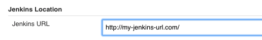
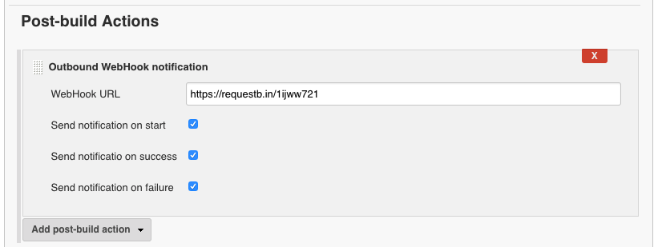

# Jenkins WebHook plugin

Outbound WebHook for Jenkins build events


## Configuration

Configure your Jenkins URL in `Jenkins > Configuration` section:



Add `Outbound Webhook notification` to `Post-build Actions`:




## Sample payload

```json
{
  "buildName": "#16",
  "buildUrl": "http://my-jenkins-url.com/job/test%20job/16/",
  "event": "success",
  "projectName": "test job",
  "buildVars": "..."
}
```

`event` has four possible values: `start`, `success`, `failure`, `unstable`.


## Compile

```bash
./gradlew build

# or within a docker image:
./gradlew-docker build
```


## Test

```bash
./gradlew test

# or within a docker image:
./gradlew-docker test
```


## Run server

```bash
./gradlew server

# or within a docker image, port 8080 is forwarded to the docker host:
./gradlew-docker server
```

Visit http://localhost:8080

The first time you visit it, you are required to go through the setup process.
Please **don't install** any third-party plugins. This plugin we currently working on will be installed by default.


## Admin user

I use the following credential for testing: `admin/admin`

Of course you don't have to copy my example.


## publish

Create a tag on GitHub: `outbound-webhook-plugin-<version>`.

Create file `~/.jenkins-ci.org` with the following content:

```
userName=username
password=password
```

Note: The credentials are from https://accounts.jenkins.io/.

Run:

```bash
./gradlew clean publish

# or within a docker image:
./gradlew-docker clean publish
```
